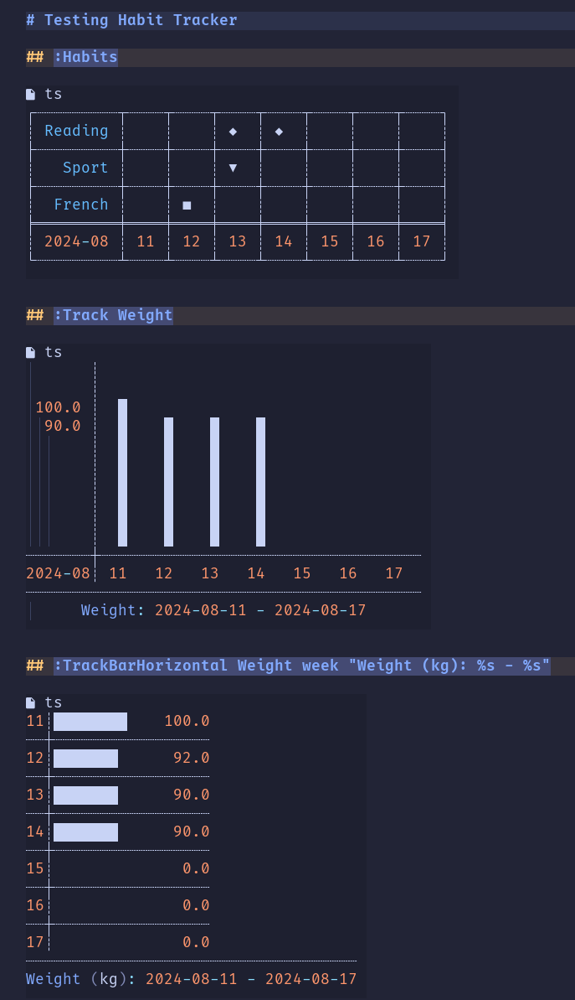

# Habits Tracker.nvim

**Habits Tracker.nvim** is a Neovim plugin designed to help users track their daily habits, visualize progress with charts, and manage journal entries seamlessly within Neovim.

## Features

- **Track Habits**: Easily log your daily habits.
- **Visualize Progress**: Generate line and bar charts to visualize your habits over time.
- **Journal Management**: Create and manage daily journal entries, complete with templating support.
- **Custom Commands**: Use custom Neovim commands to interact with your habits and journal.

## Examples



## Installation

You can install `habits-tracker.nvim` using your preferred Neovim plugin manager.

### Using `packer.nvim`

```lua
use 'praczet/habits-tracker.nvim'
```

### Using `vim-plug`

```vim
Plug 'praczet/habits-tracker.nvim'
```

After installing the plugin, don't forget to run `:PackerSync` or `:PlugInstall` to install the plugin.

## Configuration

You can configure `habits-tracker.nvim` by setting up the options in your `init.lua` or `init.vim`:

```lua
require('habits-tracker').setup({
    journals = "/path/to/your/journals",   -- Path to your journal directory
    day_format = "%Y-%m-%d.md",            -- Format for journal file names
    template_file = "/path/to/template.md" -- Path to your daily journal template
})
```

### Default Configuration

If no configuration is provided, the plugin will use the following defaults:

```lua
require('habits-tracker').setup(
  {
    journals = "~/Notes/Journal/daily", -- path to your journals
    day_format = "%Y-%m-%d.md",         -- daily journal file format
    tmpl_daily = "~/Notes/templates/Daily.md", -- path to your daily journal template
    habits = { -- habits to track
      {
        label = "French",       -- habit name (section in YAML front matter)
        style = { fg = "red" }, -- not used yet
        symbol = "■",           -- symbol displayed in calendar
      },
      { -- Update this section
        label = "Reading",
        style = { fg = "red" },
        symbol = "◆",
      },
    },
    charting = {
      line = {},  -- will contain configuration for line chart
      bar = {     -- configuration for bar chart
        show_legend = true, -- Displays legend
        show_oxy = true,    -- Displays oxy
        oxy = {
          cross = "┼",  -- character used to draw OXY
          ver = "┊",
          hor = "┈",
        },
      },
    },
    calendar = {        -- calendar configuration (Habits command)
      padding = { 1, 1 }, -- padding for symbol (for now only left and right)
      gird = {           -- grid configuration
        enable = true,   -- enable grid
        borders = {
          hor = "┈",
          ver = "┊",
          left_down = "└",
          right_down = "┘",
          left_up = "┌",
          right_up = "┐",
          left_cross = "├",
          right_cross = "┤",
          cross = "┼",
          top_cross = "┬",
          down_cross = "┴",
          xs_hor = "═",
          xs_left_cross = "╞",
          xs_right_cross = "╡",
          xs_cross = "╪",
        },
        enable_vertical_lines = true,
        enable_horizontal_lines = true,
      },
      days_label = true, -- I have to check it :-)
      title = "Habits Tracker",
      title_format = "",
    },
  }
  )
```

## Usage

### Habit Tracking

To track habits, you can use the custom command `:Habits`. This command supports various parameters to filter and display your habits:

- `:Habits` — Displays the habits for the current week and habits declared in
  config
- `:Habits date` — Displays the habits for the specified date. Date can be:
  - **week** - for current week
  - **month** - for current month (not implemented yet)
  - **year** - for current year (not implemented yet)
  - **YYYY-MM-DD:YYYY-MM-DD** - for specific date range
- `:Habits date habits` — Displays habits for the specified date and list of
  habits.

### Track

The `:Track` command allows you to track values (numeric values like weight, time, etc.). It draws Vertical BarChart
`:Track value_name date title` (for example, `:Track weight 2024-02-01 "My Weight"`)

- **value_name** — The name of the value you want to track specified in YAML front matter.
- **date** — The date to track the value on. Can be:
  - **week** - for current week
  - **month** - for current month (not implemented yet)
  - **year** - for current year (not implemented yet)
  - **YYYY-MM-DD:YYYY-MM-DD** - for specific date range
- **Title** (optional, default: `value_name .. ": " .. "%s - %s"`) — Title of the chart. You can add two %s, the first will be replaced with `date_start` and the second will be replaced with `date_end`.

There are two more commands available:

- `:TrackBarHorizonal` - parameters are the same as for `:Track` command
- `:TrackBarVertical` - parameters are the same as for `:Track` command

### Journal Management

The `:Journal` command allows you to create or open journal entries:

- `:Journal` — Opens or creates the journal entry for today.
- `:Journal 2024-02-01` — Opens or creates the journal entry for the specified date.
- `:Journal weight=89 reading=true` — Opens or creates today's journal entry and sets specific fields.
- `:Journal 2024-02-01 weight=89 reading=true` — Opens or creates journal entry for specified date and sets specific fields.

The journal entries use a template that you can customize. The template supports placeholders that are automatically replaced when creating a new entry:

- `##day##` — Replaced with the date of the entry.
- Other placeholders (e.g., `##mood##`, `##weight##`) can be set via the command options.

#### Daily template example

```markdown
---
date: ##day##
Mood: ##mood##
French: ##french##
Develop: ##develop##
Reading: ##reading##
Sport: ##sport##
Weight: ##weight##
---

# ##day##

## Topic 1

## Day's summary

## ToDo
```

## File Structure

- **lua/habits-tracker/**:

  - `init.lua`: Initializes the plugin.
  - `utils.lua`: Utility functions.
  - **charting/**:
    - `line.lua`: Line chart functionality. (not implemented yet)
    - `bar.lua`: Bar chart functionality.
    - `init.lua`: Initializes charting.
  - **calendar/**:
    - `habits.lua`: Handles habit tracking.
    - `init.lua`: Initializes calendar-related functions.
  - **journal/**:
    - `parser.lua`: Parses journal entries.
    - `init.lua`: Initializes journal features.

## License

This plugin is licensed under the MIT License. See the `LICENSE` file for more information.

## Contributing

Contributions are welcome! Feel free to open an issue or submit a pull request on the [GitHub repository](https://github.com/praczet/habits-tracker.nvim).

## Acknowledgments

Thank you to the Neovim community for their support and contributions.
